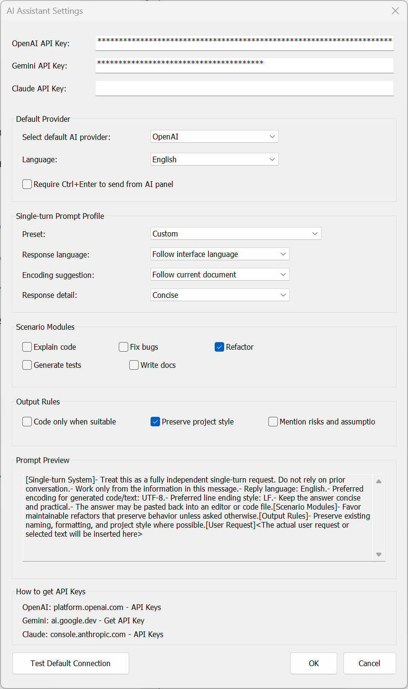

# NppAIAssistant for Notepad++

[繁體中文](README_zh-TW.md)

A lightweight AI assistant plugin for Notepad++ that keeps the workflow visible, local, and predictable.

This repository packages the AI experience as a regular Notepad++ plugin instead of a deep core modification. The result is easier installation, easier maintenance, and a cleaner path for future release and sharing on GitHub.

## Why This Project

Most editor AI integrations become opaque very quickly: hidden system prompts, unclear memory behavior, and too much coupling to the host application.

`NppAIAssistant` takes a different route:

- Lightweight plugin architecture instead of a permanent core fork
- Prompt visibility so you can see what will actually be sent
- Single-turn conversations with no hidden memory across requests
- Dynamic model loading after login or API key setup
- Practical right-click actions for explain, refactor, comments, and fixes
- Bilingual-friendly UI direction for English and Traditional Chinese

## Highlights

### Lightweight by design
The AI assistant runs as a standalone Notepad++ plugin. That means the editor stays cleaner, the deployment path stays familiar, and the feature can evolve without binding everything back into the main Notepad++ executable.

### Prompt visibility
The settings dialog includes a prompt preview area. As you change preset, language, encoding advice, response detail, scenario modules, or output rules, the generated prompt changes immediately on screen.

### No hidden memory
Every request is intentionally single-turn. The plugin does not rely on cross-request chat memory. Each response is generated from the current request only, which makes behavior easier to reason about and easier to audit.

### Fast editing workflow
Common AI actions are available from the context menu, so you can select text and trigger an action directly inside Notepad++.

## Screenshots

### Prompt preview in settings


### Preset-driven single-turn prompt builder


### Context menu actions


## Installation

### Standard Notepad++ plugin layout
1. Build the project in `Release | x64`.
2. Copy the generated DLL to:
   `<Notepad++>\plugins\NppAIAssistant\NppAIAssistant.dll`
3. Restart Notepad++.

Current build output:
`build/NppAIAssistant/x64/Release/plugins/NppAIAssistant/NppAIAssistant.dll`

### Optional helper script
A helper install script is included at:
`scripts/install-npp-ai-plugin.ps1`

## Usage

1. Open the AI panel from the plugin menu.
2. Configure your provider API key in Settings.
3. Let the plugin fetch models dynamically from the selected provider.
4. Choose a preset or fine-tune the single-turn prompt settings.
5. Review the prompt preview before sending.
6. Ask in the panel, or select text and use the right-click AI actions.

Detailed usage notes:
- [Usage Guide](docs/USAGE.md)
- [Project Structure](PROJECT_STRUCTURE.md)
- [Plugin Build Notes](plugins/NppAIAssistant/README.md)

## Repository Layout

This repo still contains the upstream Notepad++ source tree, but AI-specific work is centered in:

- `plugins/NppAIAssistant/` for the plugin implementation
- `PowerEditor/src/MISC/Common/` for shared HTTP, provider, and secure storage helpers
- `docs/` for GitHub-facing documentation and screenshots

More detail:
- [Project Structure](PROJECT_STRUCTURE.md)

## Privacy and Publishing Notes

This repository is being cleaned for public sharing. Local working artifacts and internal discussion traces are intentionally excluded from Git tracking where possible.

The plugin's interaction model is designed to be explicit:
- prompts are previewable
- requests are single-turn
- memory is not carried across requests by default

## Build

For plugin-focused work, use MSBuild on Windows:

```powershell
& "C:\Program Files (x86)\Microsoft Visual Studio\2022\BuildTools\MSBuild\Current\Bin\MSBuild.exe" "plugins\NppAIAssistant\NppAIAssistant.vcxproj" /p:Configuration=Release /p:Platform=x64 /m
```

## Status

This is an active Notepad++ AI plugin refactor with emphasis on:
- practical installation
- visible prompting
- low coupling
- predictable single-turn behavior
